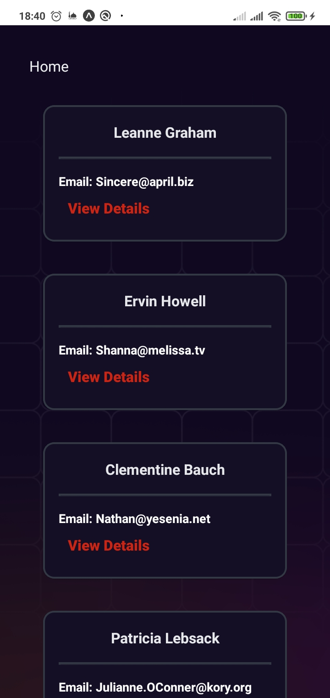
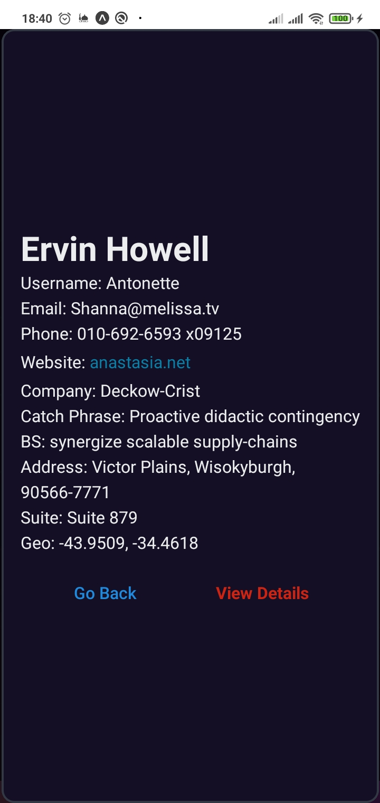
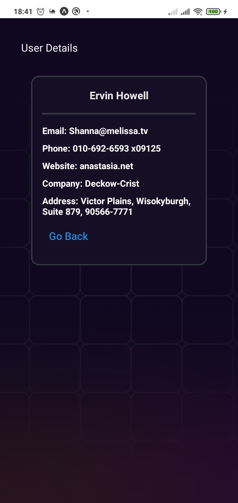

## Expo Users List - An Expo demo to display a list of users

Expo Users List a simple react native app contains home screen, a list of all users with the ability to display user details in a modal or in a new screen. It is built using:

- React Native
- Expo
- TypeScript
- Zustand
- React Native Modal
- React Native Elements

## 👾 Features

- Fetch and display a list of users in a scrollable view, each user in a card with username and email
- Display the details of a specefic user in a modal.
- Fetch and display a user with id in a new screen.

## 📒 Process

I started by implementing the functionality of fetching and displaying a list of users. Next, I added the ability to open a specefic user info in a modal component. Afterwards, I focused on the capability to fetch and display a user's details with id in a new screen.

Then I styled the board, drawing inspiration from modern UI systems boards, based on my experience.

Subsequently, I performed some small refactoring and styling touch-ups.

Some features were added in between the main features development.

**NOTE:** The project's purpose is demonstrate the use of React Native, Expo, TypeScript, Zustand, React Native Elements and React Native Modal.

## 🚦 Running the Project

To run the project in your local environment, follow these steps:

1. Clone the repository to your local machine.
2. Run `npm install` in the project directory to install the required dependencies.
3. Run `npm run start` to get the project started.

To build for android, run this command: 
1. `npm run build:android`

To build for ios, run this command: 
1. `npm run build:ios`

## 📱 ScreenShots
<table>
  <tr>
<td></td>
<td></td>
<td></td>
  </tr>
</table>

